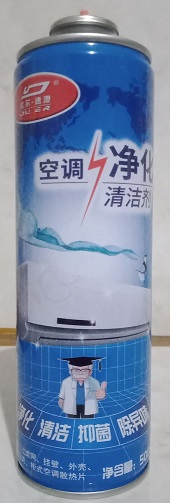
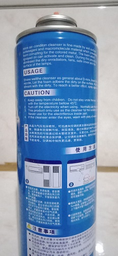
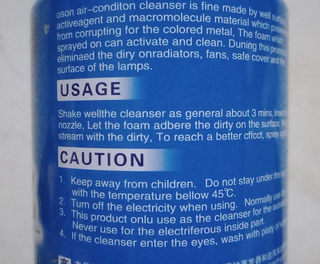
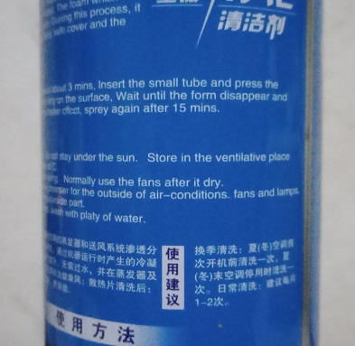

# "Palty" of questions: A look at an aircon cleaner product with terrible english

Alright, let's set the stage.

So it was a Sunday morning and my father was preparing to clean out the air conditioner.
The usual procedure of this was to wash down the dirt with a pressure washer and then wash it down with whatever non-bathing soap he could get his hands on. This time though, he bought a can of spray foam aircon cleaner just for this day. You see, he had to delay the cleaning for a long time. How long you ask? 5-ish months. We are a very busy family.

And so dirt and random airborne detritus began piling up first on the filter, a filter which was often neglected and only cleaned when there is a literal carpet of dust on the surface. It then travelled its way through the aircon and eventually exits. By the time we actually started cleaning it, it was so caked on with dirt that when time came to clean it, the water was pretty much chunky by the time we're done.

Now onto the part where we roast a can of spray foam cleaner. The cleaner came from China (obviously). Here is what the can looked like:

As you can see, it is all in Chinese. Here we see a generic split-type aircon on top of a generic transparent clipart jpeg of a man holding a thumbs up wearing a generic transparent clipart jpeg of a graduation hat. Apparently he just graduated Chinese Harvard. Here is what the back looks like:

Fourtunately, there is some amount of english text here. Let's see:

> oson air-conditon cleanser is fine made by well surface
> activeagent and macromolecule material which prevented from corrupting for the colored metal.

Okay, there are some mistakes there. Let's skip to the "USAGE" section:

> Shake wellthe cleanser as general about 3 mins. Insert the small tube and press the 
> nozzle. Let the foam adbere the dirty on the surface, Wait until the form disappear and stream with the dirty, To reach a better cfffffffffff...

*cffkt?*

*kfcct?*

How the heck did "effect" become "cffcct", why is "spray" spelled "spr**e**y" and why is "plenty" now "palty". Usually (well at least 50% of the time) with these translation mishaps the words are spelled correctly, but whatever government-mandated translation service this was used to translate this to english either had a stroke translating it, or had not paid it's proofreaders and moderators enough and started accepting anything as a form of protest. At least they spelt "[electriferous](https://en.wiktionary.org/wiki/electriferous)" correctly.

After I saw this broken english, I then proceeded to recite this scripture from the gods to my father. He laughed, and then told me that he bought it off online from a website where there are many Chinese products, each with their equally as grammatically incorrect translations. This justified the Engrish since it came from a country where english is not widely spoken, and even when it is spoken, the grammar are like this can's english. Maybe it wasn't a good idea to let this foamy substance sit on my hands nor to spray this in the indoor part of the window unit.

In conclusion, at least it isn't as bad as the...

other broken english I saw over the years on the internet, but this is certainly a good example of why you should just learn the language instead of blindly trusting a translation service.